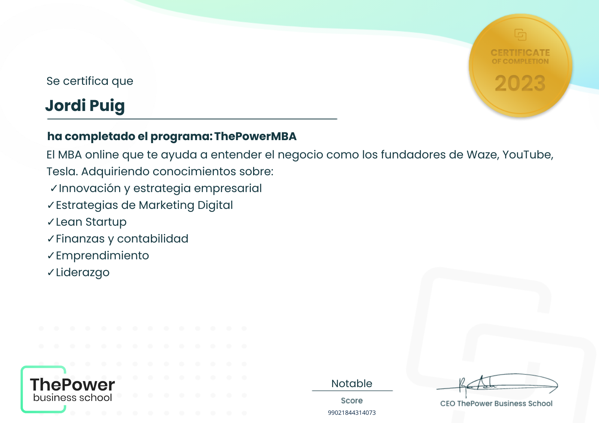

## Hi there! I'm Jordi 👋

I'm a Data Engineer with a passion for cloud computing, data warehousing, and Python. Right now, I'm teaching programming at UPC University in Barcelona while working on exciting projects in the data engineering space.

## My Skills as a Data Engineer

* __Programming Languages:__ Python, SQL, Scala & others
* __Cloud Platforms:__ Azure (DP-203)
* __Data Warehousing:__ Azure Synapse, Snowflake
* __ETL tools__: Azure Data Factory, SSIS, IICS, Fivetran, dbt

### Certifications

* Azure DP-203: Data Engineering on Microsoft Azure
* ThePower Business School: Power MBA
* Hands-On Essentials: Data Engineering Workshop (progress for SnowPro Core)

    
    
    

#### In progress / Next steps

* [ ] Snowflake: SnowPro® Core Certification
* [ ] AWS Certified Solutions Architect - Associate

---
### Programming Languages

---

## Contact information

* Email: jordipuig37@gmail.com
* Linkedin: [Jordi Puig Rabat][linkedin]

[linkedin]: https://www.linkedin.com/in/jordi-puig-rabat/
