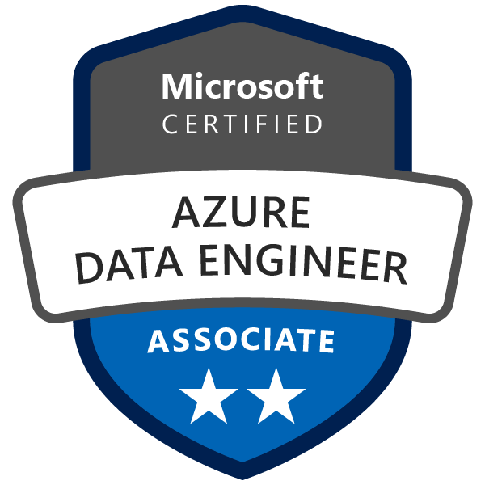
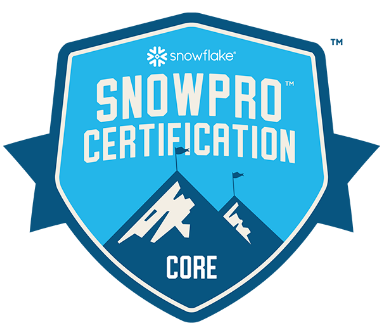

## Hi there! I'm Jordi 👋

I'm a Data Engineer with a passion for cloud computing, data warehousing, and data architecture.

## My Skills as a Data Engineer

* __Programming Languages:__ Python, SQL, Scala & others
* __Cloud Platforms:__ Azure (DP-203)
* __Data Warehousing:__ Azure Synapse, Snowflake (Snowpro Core)
* __ETL/ELT tools__: Azure Data Factory, Fivetran, dbt
* __Dashboard and visualization__: PowerBI (custom visuals)

### Certifications

* Azure DP-203: Data Engineering on Microsoft Azure
* ThePower Business School: Power MBA
* Snowflake SnowPro Core Certification

    
    
    

#### In progress / Next steps

* [x] Snowflake: SnowPro® Core Certification
* [ ] Microsoft Certified: Azure Administrator Associate
* [ ] Microsoft Certified: Azure Security Engineer Associate
* [ ] Microsoft Certified: Azure Solutions Architect Expert
* [ ] AWS Certified Solutions Architect - Associate

---
### Programming Languages

---

## Contact information

* Email: jordipuig37@gmail.com
* Linkedin: [Jordi Puig Rabat][linkedin]

[linkedin]: https://www.linkedin.com/in/jordi-puig-rabat/
